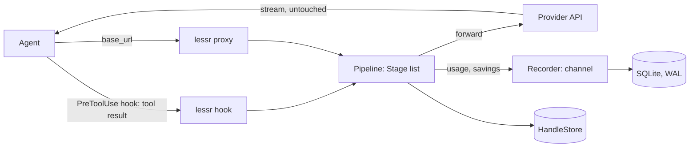

# Architecture

One binary, two entry paths, one pipeline. Everything runs on localhost; the only outbound request is the forwarded provider call.



## Entry paths

**Hook path.** Agents that support pre-tool hooks (Claude Code, Cursor, Gemini CLI, Codex, OpenCode plugin) call `lessr hook <agent>` with the tool call as JSON on stdin. The pipeline runs `on_tool_result`; the rewritten result goes back on stdout. Gate, trap and dedup run here. One process spawn per call: keep startup under 2 ms (memory-mapped config and pack snapshots, no SQLite open on this path).

**Proxy path.** Agents and SDKs point `base_url` at `http://127.0.0.1:7433`. `lessr-proxy` accepts `/v1/messages` (Anthropic) and `/v1/chat/completions` (OpenAI shape), runs `on_request`, forwards with the original headers, streams the body back byte-for-byte, and parses usage from the final SSE event or JSON body. Detection runs here; the free engine only reports.

## The pipeline

`lessr_core::Pipeline` holds an ordered `Vec<Box<dyn Stage>>`. Each stage has a `Tier` (Free or Pro) for the receipt, a `Mode` (Off, Shadow, Active) from config and the self-healing table, and three optional hooks: `on_tool_result`, `on_request`, `on_usage`.

The pipeline times every stage with a monotonic clock. A stage over `Budget::soft` (2 ms) is logged; one over `Budget::hard` (10 ms) is skipped for the rest of the session and reported. The budget is a contract.

Order on the hook path: `trap → gate → dedup`. Proxy path: `detect`. Pro crates insert stages at declared positions (`Position::Before("gate")`, `Position::After("detect")`).

## Handles

Anything removed goes into `HandleStore` first and is referenced by a 4-hex-char id from the blake3 hash of the removed bytes. Append-only file per session under the config dir with an in-memory index; `lessr show <id>` reads it. Handles survive compaction because compaction is a stage that must write handles.

## Receipt

`lessr_receipt::Recorder` owns an mpsc channel and a background thread that batches inserts into SQLite (WAL). Stages send `Saving` and `Usage` events; nothing on the hot path touches the database.

## Packs

Filters are data. A pack is a directory of TOML rules plus a manifest signed with ed25519. The base pack is embedded with `include_bytes!`; packs on disk override it if their signature verifies. Rules compile at load into `RegexSet`s and are cached as a memory-mapped blob keyed by pack hash.

## Adapters

`lessr-adapters` knows, per agent, where the config lives and how to add a hook or a `base_url`. `lessr init` detects installed agents, backs up configs, patches them, and prints what changed. `lessr uninstall` restores backups. An existing `rtk` hook is chained, not overwritten.

## Crate dependency graph

```
lessr-cli ─┬─ lessr-proxy ─── lessr-core
           ├─ lessr-adapters ─ lessr-core
           ├─ lessr-gate ──┬─ lessr-core
           │               └─ lessr-packs
           ├─ lessr-dedup ── lessr-core
           ├─ lessr-detect ─ lessr-core
           └─ lessr-receipt ─ lessr-core
```

`lessr-core` depends on nothing in the workspace. Pro crates depend on `lessr-core` and, where needed, `lessr-gate` or `lessr-receipt`; never the reverse.

## Configuration

`~/.config/lessr/config.toml` (XDG; `~/Library/Application Support/lessr` on macOS; `%APPDATA%\lessr` on Windows). Per-stage `mode`, per-repo overrides, proxy port, provider upstreams. The hook path reads a binary snapshot regenerated whenever the TOML changes.
